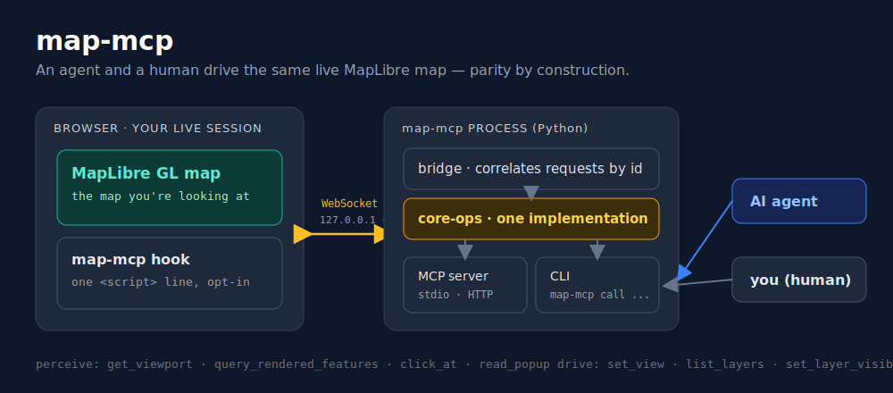

# map-mcp

Drive and perceive an **existing, live MapLibre GL map** from an AI agent (over MCP) or a human
CLI — query the rendered features, read the viewport, click and read popups, navigate, toggle
layers. The agent and the CLI act on the **same map a person is looking at**, with parity by
construction.

It does **not** generate maps. Other geo-MCP servers (gis-mcp, Mapbox, CARTO) create maps or
call GIS operations; map-mcp reaches into a map that's *already on screen*. Think of it as the
agent-native counterpart to [MapGrab](https://github.com/maxlapides/mapgrab): same live-map
access, but conversational over MCP instead of written as test code.

> **Status:** v1, MapLibre GL only. Cooperation-required (your app adds a one-line hook). A
> no-cooperation path and other map libraries are future work.


*A [LangChain agent](examples/langchain_agent.py) finds the most-populous visible city and
navigates to it — perceiving and driving the live map through map-mcp.*

## Install

```
uvx map-mcp --help          # or: pip install map-mcp
```

## Quickstart

1. **Start the bridge + MCP server.** It prints a WebSocket URL and a per-session token.
   ```
   map-mcp serve
   ```
2. **Add the hook to your MapLibre page** (`map` is your existing `maplibregl.Map`):
   ```html
   <script src="map-mcp-hook.js"></script>
   <script>
     mapMcp.register(map, { url: "ws://127.0.0.1:8765", token: "PASTE_TOKEN" });
   </script>
   ```
3. **Point your agent at the MCP server** (stdio by default; `--transport http` for HTTP/SSE).
   Or drive it yourself from the terminal:
   ```
   map-mcp call get_viewport
   map-mcp call query_rendered_features --params '{"point":[12.5,41.9]}'
   ```

There's a runnable sample app in [`examples/sample_app/`](examples/sample_app/).

## Example: a LangChain agent

[`examples/langchain_agent.py`](examples/langchain_agent.py) is a real agent — a langgraph
ReAct agent on any tool-capable model — that drives the live map through map-mcp's operations
(it's how the GIF above was made). Give it the map-mcp tools and a task, and it perceives and
navigates the map itself:

```
export OPENROUTER_API_KEY=sk-or-...
uvx playwright install chromium          # one-time, for the live browser
uv run --extra demo python examples/langchain_agent.py
```

It defaults to an OpenRouter model (set `OPENROUTER_MODEL` to change). The agent's tools are
thin wrappers over the same `CoreOps` the MCP server exposes — so anything the agent does, the
CLI does too.

## Tools (the operation surface)

The agent's MCP tools and the CLI's `call` operations are exactly the same set:

| Operation | What it does |
|---|---|
| `get_viewport` | center `[lng,lat]`, zoom, bearing, pitch, bounds |
| `query_rendered_features` | features currently rendered (optionally at a point or within a bbox) |
| `get_features_at` | features rendered at a `[lng,lat]` point |
| `click_at` | fire the map's click at a point (runs your popup handlers), return features + popup |
| `read_popup` | text of any open popup(s) |
| `set_view` | center+zoom (and bearing/pitch), or fit a bbox |
| `list_layers` | the style's layers + visibility |
| `set_layer_visibility` | show/hide a layer |
| `screenshot` | a PNG data URL of the current map* |

Perception returns **structured feature properties** (GeoJSON-shaped) — agents reason over
properties, not pixels. `screenshot` is optional.

\* needs the map created with `preserveDrawingBuffer: true` (see [`hook/snippet.md`](hook/snippet.md)).

## How it works



The hook connects *out* to a loopback WebSocket the `map-mcp` process runs. The MCP tools and
the CLI are thin frontends over one shared core-operations layer, so any operation one can do,
the other can too.

**Security model (local-only).** The bridge binds `127.0.0.1` only, so nothing off your machine
can reach it. Browsers do *not* apply same-origin policy to WebSocket connections, so the
**per-session token is the security boundary**: only a page that presents it can drive your map.
Treat the token like a secret — the convenience `?token=` pattern in the example leaks it via
browser history and server logs, so for anything sensitive paste the token into the page rather
than the URL. A hardened Origin allowlist is future work.

## Scope (v1)

- **In:** MapLibre GL; the operations above; stdio + HTTP/SSE; a human CLI with parity.
- **Out:** generating maps; a hosted service; non-map visualizations; other map libraries
  (Leaflet/deck.gl) and a no-cooperation (Playwright) path are future work.

## License

MIT
